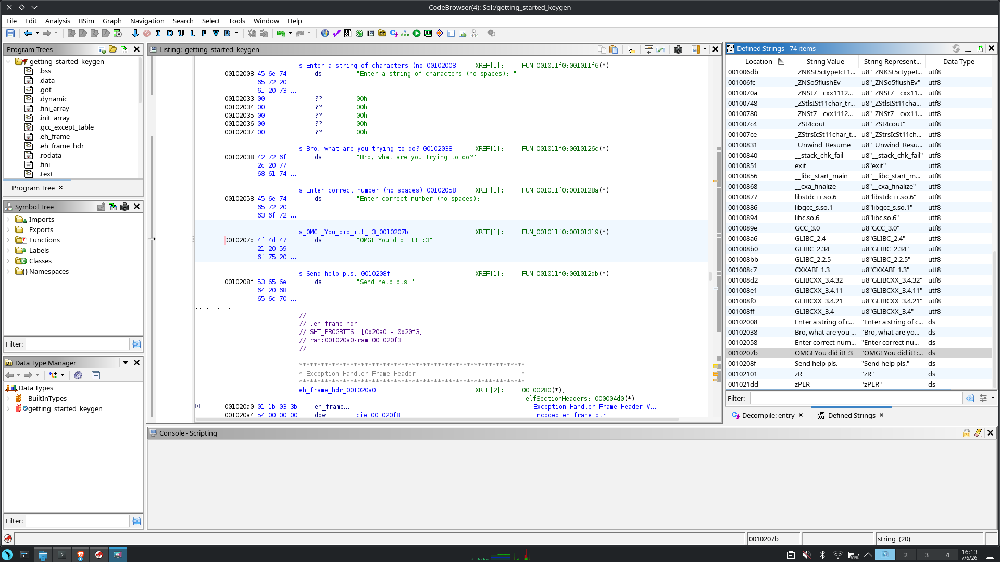
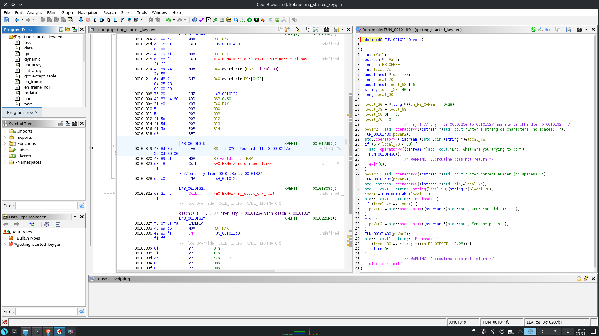
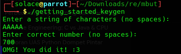

# Writeup: Getting Started Keygen

## Informasi Crackme
- **Nama Crackme:** Getting Started Keygen
- **Sumber:** [crackmes.one](https://crackmes.one/)
- **Level:** Easy
- **Tools yang Digunakan:** Ghidra

---

## 1. Pengintaian Awal (Reconnaissance)
Langkah pertama dalam menganalisis program ini adalah memahami apa yang sebenarnya diminta oleh program. Saya memulainya dengan mencari *string* (teks yang bisa dibaca) di dalam file *binary*.

**Langkah:**
Saya menggunakan fitur **Search -> For Strings** (Defined Strings) di Ghidra. 



Seperti yang terlihat pada gambar di atas, dari hasil pencarian saya menemukan beberapa petunjuk penting:
- Program meminta dua jenis *input*: sebuah teks (string) dan sebuah angka (number).
- Terdapat pesan sukses: `"OMG! You did it! :3"`.

Penemuan ini memberi saya target: mencari bagian kode yang mencetak pesan `"OMG! You did it! :3"` dan melihat kondisi apa yang harus dipenuhi untuk mencapai titik tersebut.

---

## 2. Analisis Statis dengan Ghidra
Setelah mendapatkan gambaran umum, saya memuat program ke dalam Ghidra untuk melihat *decompiled code*.

**Langkah:**
Saya mencari fungsi `main` yang berada di alamat `0x11f0`. Berikut adalah tampilan fungsi tersebut di Ghidra beserta *decompiled code*-nya:



Berdasarkan tangkapan layar di atas, berikut adalah cuplikan kode dekompilasi yang relevan (telah disederhanakan):

```c
std::operator<<((ostream *)std::cout,"Enter a string of characters (no spaces): ");
std::operator>>((istream *)std::cin,(string *)&local_78);

if (5 < local_70 - 5U) {
    std::operator<<((ostream *)std::cout,"Bro, what are you trying to do?");
    exit(0);
}

std::operator<<((ostream *)std::cout,"Enter correct number (no spaces): ");
std::istream::operator>>((istream *)std::cin,&local_7c);

std::__cxx11::string::string(local_58,(string *)&local_78);
iVar1 = FUN_001014b0(local_58);

if (local_7c == iVar1) {
    std::operator<<((ostream *)std::cout,"OMG! You did it! :3");
} else {
    std::operator<<((ostream *)std::cout,"Send help pls.");
}

```

**Analisis Alur:**
1.  **Input String:** Program meminta teks tanpa spasi.
2.  **Validasi Panjang:** Ada pengecekan `if (5 < local_70 - 5U)`. Ini adalah trik *compiler* untuk mengecek rentang. Pada dasarnya, kode ini memastikan panjang string yang dimasukkan harus antara **5 hingga 10 karakter**.
3.  **Input Angka:** Program meminta angka yang benar.
4.  **Proses Keygen:** Input string kita dikirim ke fungsi rahasia `FUN_001014b0`. Fungsi ini mengembalikan sebuah nilai integer (`iVar1`).
5.  **Pengecekan Akhir:** Nilai integer yang dikembalikan fungsi tadi (`iVar1`) dibandingkan dengan angka yang kita masukkan (`local_7c`). Jika sama, kita berhasil.

---

## 3. Membedah Fungsi Keygen (`FUN_001014b0`)
Fungsi `FUN_001014b0` adalah inti dari tantangan ini. Saya perlu tahu bagaimana ia mengubah teks *input* menjadi sebuah angka.

**Langkah:**
Saya memeriksa dekompilasi fungsi `FUN_001014b0`. Saya menemukan sebuah *loop* (perulangan) yang memproses string karakter demi karakter.

Operasi utama di dalam *loop* tersebut adalah operasi **XOR** (dilambangkan dengan `^`). Setiap karakter dari string yang saya masukkan diubah menjadi nilai ASCII-nya, lalu di-XOR dengan sebuah angka dari array atau tabel yang tersimpan di memori.

Saya melacak tabel tersebut di alamat `0x4020` (`DAT_00004020` di Ghidra). Dengan mengubah tipe datanya menjadi *32-bit integer* (DWord), saya mendapatkan 10 deret angka:
`[4, 79, 129, 171, 254, 123, 224, 204, 70, 53]`

Algoritma fungsi ini dapat disederhanakan menjadi pseudocode berikut:

```
total_sum = 0
untuk setiap index 'i' dari karakter di string:
    nilai_xor = karakter_ascii[i] XOR tabel_rahasia[i]
    total_sum = total_sum + nilai_xor
kembalikan total_sum
```

---

## 4. Merumuskan Solusi (Solving)
Sekarang saya memahami aturannya:
1. Pilih string apapun dengan panjang 5-10 karakter.
2. Hitung total penjumlahan XOR setiap karakter string tersebut dengan angka di tabel rahasia secara berurutan.
3. Total penjumlahan tersebut adalah "correct number" yang harus dimasukkan.

**Langkah Manual:**
Saya memilih string sederhana: `"AAAAA"`.
- Panjangnya 5 karakter (memenuhi syarat 5-10 karakter).
- Nilai ASCII huruf 'A' adalah `65`.

Saya menghitung nilai XOR-nya:
- Huruf 1 ('A'): `65 XOR 4`   = 69
- Huruf 2 ('A'): `65 XOR 79`  = 14
- Huruf 3 ('A'): `65 XOR 129` = 192
- Huruf 4 ('A'): `65 XOR 171` = 234
- Huruf 5 ('A'): `65 XOR 254` = 191

Total = `69 + 14 + 192 + 234 + 191` = **700**.

Ketika saya menjalankan program dengan string `"AAAAA"` dan angka `"700"`, program mencetak `"OMG! You did it! :3"`.



Seperti yang dibuktikan pada tangkapan layar eksekusi terminal di atas, perhitungan manual saya cocok dengan logika program
