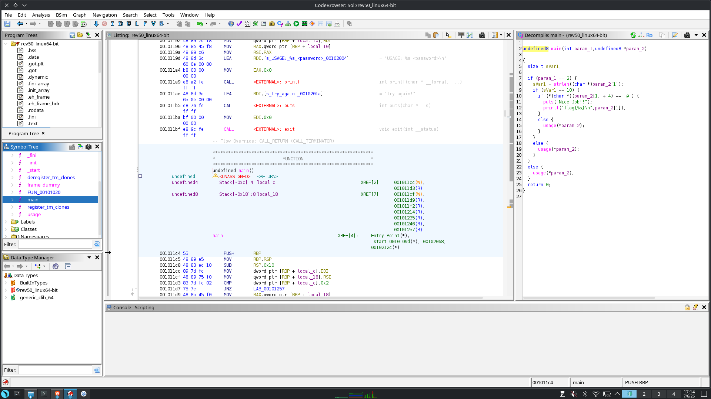
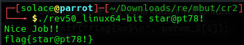

# Writeup: easy_reverse

## Informasi Crackme
- **Nama Crackme:** easy_reverse
- **Sumber:** [crackmes.one](https://crackmes.one/)
- **Level:** Easy
- **Tools yang Digunakan:** Ghidra

---

## 1. Analisis Statis & Dekompilasi
Karena program ini dikategorikan sangat dasar, saya langsung memuat file *binary* (`rev50_linux64-bit`) ke dalam **Ghidra** untuk melakukan dekompilasi dan membaca struktur logika utamanya.

Setelah proses analisis selesai, saya langsung melompat ke fungsi `main`. Berikut adalah *screenshot* jendela *Decompile* dari Ghidra yang memperlihatkan logika inti program:



---

## 2. Membedah Logika Program (Proses Berpikir)
Berdasarkan *decompiled C code* yang terlihat pada gambar di atas, mari kita bedah logika program baris demi baris:

```c
undefined8 main(int param_1, undefined8 *param_2) {
    size_t sVar1;
    // ...
```

### Syarat Pertama: Argumen Baris Perintah (Command Line Argument)
```c
    if (param_1 == 2) {
```
Variabel `param_1` dalam fungsi `main` (bahasa C) biasanya melambangkan `argc` (*argument count*), yaitu jumlah argumen yang diberikan saat program dijalankan via terminal.
- Jika nilainya `2`, berarti program dijalankan dengan format: `./program <password>`.
- Jika argumen tidak sama dengan 2 (misalnya dijalankan tanpa password tambahan), program akan melompat ke blok `else` paling bawah dan memanggil fungsi `usage(*param_2)`, yang kemungkinan mencetak teks seperti `"USAGE: ./program <password>"`.

### Syarat Kedua: Panjang Karakter Password
```c
        sVar1 = strlen((char *)param_2[1]);
        if (sVar1 == 10) {
```
- `param_2[1]` adalah `argv[1]`, yaitu teks *password* yang kita ketik.
- `strlen` menghitung panjang teks tersebut.
- Baris `if (sVar1 == 10)` mensyaratkan bahwa *password* yang dimasukkan **harus memiliki panjang tepat 10 karakter**.

### Syarat Ketiga: Karakter Spesifik pada Posisi Tertentu
```c
            if (*(char *)((param_2[1]) + 4) == '@') {
```
Ini adalah kunci penyelesaian utamanya (*The Flag Check*).
- `param_2[1]` adalah string awal (indeks ke-0).
- `+ 4` berarti bergeser sebanyak 4 posisi dari awal. Dalam pemrograman C (yang indeksnya dimulai dari 0), posisi ke-4 adalah **karakter ke-5** dari string tersebut.
- Karakter tersebut haruslah simbol `'@'`.

### Kesuksesan
```c
                puts("Nice Job!!");
                printf("flag{%s}\n", param_2[1]);
            }
```
Jika ketiga syarat di atas terpenuhi, program akan mencetak `"Nice Job!!"` dan format flag-nya: `flag{<password_kita>}`.

---

## 3. Merumuskan Solusi (Solving)
Dari analisis statis di atas, kita mendapatkan tiga aturan pasti untuk menyelesaikan *crackme* ini:
1. Program harus dijalankan lewat terminal dengan memberikan satu argumen sebagai password (contoh: `./rev50_linux64-bit <password>`).
2. Password tersebut **wajib** terdiri dari tepat **10 karakter**.
3. Karakter ke-5 (indeks ke-4) dari password tersebut **wajib** berupa simbol **`@`**.

**Meracik Password:**
Saya bebas membuat teks sembarang asalkan memenuhi aturan tersebut.
- Format: `_ _ _ _ @ _ _ _ _ _` (Total 10 tempat)
- Untuk percobaan ini, saya memilih membuat string: `"star@pt78!"`

Mari kita verifikasi:
- Panjang `"star@pt78!"` = 10 karakter. (Lolos syarat 2)
- Indeks ke-0 = `s`
- Indeks ke-1 = `t`
- Indeks ke-2 = `a`
- Indeks ke-3 = `r`
- Indeks ke-4 = `@`. (Lolos syarat 3)

---

## 4. Kesimpulan & Pembuktian
Sesuai dengan rumusan di atas, saya menjalankan program ini di terminal Linux dengan perintah beserta *password* buatan saya:

```bash
./rev50_linux64-bit star@pt78!
```

Berikut adalah hasil eksekusinya:



Program menerima masukannya, memvalidasi aturan panjang karakter dan keberadaan simbol `@` di posisi ke-5, lalu berhasil mencetak *flag* dinamisnya:
```
Nice Job!!
flag{star@pt78!}
```
