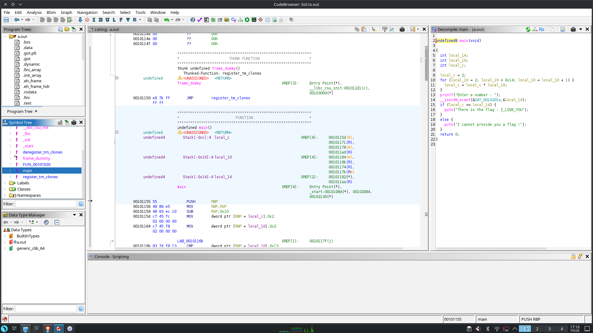
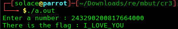

# Writeup: GDB basic

## Informasi Crackme
- **Nama Crackme:** GDB basic
- **Sumber:** [crackmes.one](https://crackmes.one/)
- **Level:** Easy
- **Tools yang Digunakan:** Ghidra

---

## 1. Analisis Statis & Dekompilasi
Untuk memahami cara kerja program ini, saya menggunakan **Ghidra** untuk membaca struktur *decompiled code* dari bahasa mesin kembali ke bahasa C. 

Setelah program dianalisis oleh Ghidra, saya langsung memeriksa fungsi `main`. Berikut adalah *screenshot* kode sumber hasil dekompilasinya:



Dari gambar di atas, kita bisa langsung melihat struktur program yang sangat sederhana. Bahkan, *flag*-nya sudah terlihat secara *hardcoded* (tertulis jelas di dalam kode) yaitu `"I_LOVE_YOU"`. 

Namun, untuk benar-benar menyelesaikan tantangan ini sebagaimana mestinya, kita harus menemukan angka tebakan yang benar agar program mencetak *flag* tersebut secara normal.

---

## 2. Membedah Logika Program (Proses Berpikir)
Mari kita bedah alur logika program berdasarkan hasil dekompilasi di atas:

### Perulangan Matematika (The Loop)
```c
local_c = 2;
for (local_10 = 2; local_10 < 0x14; local_10 = local_10 + 1) {
    local_c = local_c * local_10;
}
```
- Program menyiapkan variabel `local_c` dengan nilai awal **2**.
- Kemudian, program menjalankan *looping* (perulangan) menggunakan variabel `local_10` yang dimulai dari angka **2** hingga kurang dari **`0x14`**. 
- Angka `0x14` dalam heksadesimal bernilai **20** dalam desimal. Artinya, perulangan ini berjalan dari angka 2 sampai 19.
- Di dalam *loop*, nilai `local_c` terus dikalikan dengan angka perulangan tersebut. 
- Secara matematis, operasi ini sama dengan menghitung nilai $2 \times 19!$ (Dua dikali faktorial sembilan belas).

### Meminta Input Pengguna
```c
printf("Enter a number : ");
__isoc99_scanf(&DAT_0010201a,&local_14);
```
Setelah perhitungan selesai, program mencetak perintah ke layar dan menunggu pengguna memasukkan sebuah angka yang akan disimpan ke dalam variabel `local_14`.

### Validasi & Penentuan Pemenang
```c
if (local_c == local_14) {
    puts("There is the flag : I_LOVE_YOU");
}
```
Program membandingkan hasil perhitungan mesin (`local_c`) dengan angka yang kita masukkan (`local_14`). Jika sama persis, program akan memberikan pesan kemenangan beserta *flag*-nya.

---

## 3. Merumuskan Solusi (Solving)
Untuk mendapatkan *correct number*, kita hanya perlu memecahkan rumus matematika yang digunakan oleh program: $2 \times 19!$

Langkah perhitungannya:
1. Hitung nilai faktorial 19 ($19!$): `121645100408832000`
2. Kalikan hasilnya dengan 2: `121645100408832000 * 2`
3. Hasil akhir: **`243290200817664000`**

Angka raksasa inilah kunci jawaban (masukan) yang ditunggu oleh program.

---

## 4. Kesimpulan & Pembuktian
Saya membuka terminal Linux dan menjalankan *file binary* `a.out`. Ketika program meminta *input*, saya memasukkan hasil perhitungan murni di atas, yaitu **`243290200817664000`**.

Berikut adalah hasil eksekusinya:



Tebakan angka tersebut diolah dengan sempurna oleh program. Validasi berhasil dilewati dan program mencetak *flag* yang dicari:
```
There is the flag : I_LOVE_YOU
```
